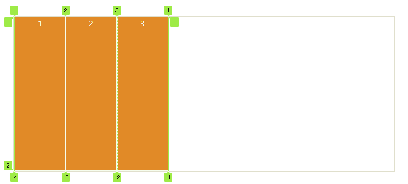

# 网格布局

Grid 布局将容器划分成"行"和"列"，产生单元格也就是项目所在。

## 基本概念

### 容器

通过在元素上声明 display：grid 或 display：inline-grid 来创建一个网格容器。

<Css-Grid example="1" />

```html
<div class="grid">
  <div>1</div>
  <div>2</div>
  <div>3</div>
</div> 
```

```css
.grid {
  display: grid;
  grid-template-columns: 100px 100px 100px;
}
```

注意： 所有直系子元素现在是网格项

### 网格轨道

通过 grid-template-columns 和 grid-template-rows 属性来定义网格中的行和列。一个网格轨道就是网格中任意两条线之间的空间。

### 网格线

应该注意的是，当我们定义网格时，我们定义的是网格轨道，而不是网格线。Grid 会为我们创建编号的网格线来让我们来定位每一个网格元素。



### 单元格

行和列的交叉区域，称为"单元格"（cell）。


## 容器属性

Grid 布局的属性分成两类。一类定义在容器上面，称为容器属性；另一类定义在项目上面，称为项目属性。这部分先介绍容器属性。

### 设置网格容器

`display: grid`指定一个容器采用网格布局。

```css
div {
  display: grid;
}
```
默认情况下，容器都是块级元素，但可以通过`inline-grid`设成行内元素

```css
div {
  display: inline-grid;
}
```

:::tip
设为网格布局后，项目的`float`、`display: inline-block`、`display: table-cell`、`vertical-align`和`column-*`等设置都将失效。
:::

### 划分行和列

- `grid-template-columns`：定义每一列的列宽
- `grid-template-rows`：定义每一行的行高

<Css-Grid example="2" />

```css
.grid-box-2 {
  display: grid;
  grid-template-columns: 33.33% 33.33% 33.33%;
  grid-template-rows: 33.33% 33.33% 33.33%;
}
```

上面代码指定了一个三行三列的网格, 列宽和行高按百分比等分（也可以设置具体数值）。

#### (1) repeat

当网格很多时，可使用`repeat()`函数,避免重复赋值。

```css
.grid-box-2 {
  display: grid;
  grid-template-columns: repeat(3, 33.33%);
  grid-template-rows: repeat(3, 33.33%);
}
```

第一个参数是重复的次数，第二个参数是所要重复的值。

同时可以重复多组模式。

```css
grid-template-columns: repeat(2, 10px 20px 30px);
```
重复2组模式，每组为3列，列宽分别为`10px`，`20px`，`30px`。

#### （2）auto-fill 关键字

自动填充每一行（或每一列），使其尽可能多容纳单元格。

<Css-Grid example="3" />

```css
.grid-box-3 {
  display: grid;
  grid-template-columns: repeat(auto-fill, 100px);
}
```

#### (3) fr 关键字

为了方便表示比例关系，网格布局提供了fr关键字（fraction 的缩写，意为"片段"）。

<Css-Grid example="4" />

```css
.grid-box-4 {
  display: grid;
  grid-template-columns: 1fr 2fr;
}
```

#### (4) minmax()

`minmax()`函数产生一个长度范围，表示长度就在这个范围之中。它接受两个参数，分别为最小值和最大值。

```css
grid-template-columns: 1fr 1fr minmax(100px, 1fr);

```

上面代码中，minmax(100px, 1fr)表示列宽不小于100px，不大于1fr。

#### (5) auto 关键字

<Css-Grid example="5" />

```css
.grid-box-5 {
  display: grid;
  grid-template-columns: 100px auto 100px;
}
```

上面代码中，第二列的宽度，基本上等于该列单元格的最大宽度，除非单元格内容设置了min-width，且这个值大于最大宽度。

#### (6) 网格线的名称

grid-template-columns属性和grid-template-rows属性里面，还可以使用方括号，指定每一根网格线的名字，方便以后的引用。

<Css-Grid example="6" />

```css
.grid-box-6 {
  display: grid;
  grid-template-columns: [l1] 100px [l2] 100px [l3] 100px [l4];
}
```

### 设置行（列）间距

- `row-gap`: 设置行与行的间隔（行间距）
- `column-gap`: 设置列与列的间隔（列间距）
- `gap`: `grid-column-gap`和`grid-row-gap`的合并简写形式

```css
grid-gap: <grid-row-gap> <grid-column-gap>;
```

<Css-Grid example="7" />

```css
.grid-box-7 {
  display: grid;
  grid-template-columns: 1fr 1fr 1fr;
  grid-template-rows: 1fr 1fr 1fr;
  gap: 10px
}
```

### 设置区域

- `grid-template-areas`: 指定"区域"（area），一个区域由单个或多个单元格组成。

<Css-Grid example="8" />

```css
.grid-box-8 {
  display: grid;
  grid-template-columns: 1fr 1fr 1fr;
  grid-template-rows: 1fr 1fr 1fr;
  grid-template-areas: 'a a a'
                       'b b b'
                       'c c c';
}
.a {
  grid-area: a;
}
.b {
  grid-area: b;
}
.c {
  grid-area: c;
}
```

:::tip
[grid-area](./#grid-area属性) 为项目属性，用来指定项目放在哪一个区域。
:::

如果不需要利用的区域，则使用"点"（.）表示。

<Css-Grid example="9" />

```css
.grid-box-9 {
  display: grid;
  grid-template-columns: 1fr 1fr 1fr;
  grid-template-rows: 1fr 1fr 1fr;
  grid-template-areas: 'a a a'
                       'b b .'
                       'c c c';
```

### grid-auto-flow 属性

设置网格布局后， 子元素会默认按照`先行后列`的顺序，自动占据网格。通过`grid-auto-flow`属性可以修改顺序。

<Css-Grid example="10" />

```css
.grid-box-10 {
  display: grid;
  grid-template-columns: 1fr 1fr 1fr;
  grid-template-rows: 1fr 1fr 1fr;
  grid-auto-flow: row;
}
```
`grid-auto-flow`默认值为`row`。


<Css-Grid example="11" />


```css
.grid-box-11 {
  display: grid;
  grid-template-columns: 1fr 1fr 1fr;
  grid-template-rows: 1fr 1fr 1fr;
  grid-auto-flow: column;
}
```
设置`column`, 排列顺序变为“先列后行”。

#### dense 值

`grid-auto-flow`属性除了设置成`row`和`column`，还可以设成`row dense`和`column dense`。这两个值主要用于，某些项目指定位置以后，剩下的项目怎么自动放置。

<Css-Grid example="12" />


```css
.grid-box-12 {
  display: grid;
  grid-template-columns: 100px 100px 100px;
  grid-template-rows: 100px 100px 100px;
  grid-auto-flow: row;
  height: unset !important;
  overflow: auto;
 }
```
现在我们设置成 `row dense`, 表示尽可能紧密填满。

<Css-Grid example="13" />

```css
.grid-box-13 {
  display: grid;
  grid-template-columns: 100px 100px 100px;
  grid-template-rows: 100px 100px 100px;
  grid-auto-flow: row dense;
  height: unset !important;
  overflow: auto;
 }
```
这个例子中，为填满第一行，将`3`提前布局。

如果将设置改为column dense，表示"先列后行"，并且尽量填满空格。

<Css-Grid example="14" />

```css
.grid-box-14 {
  display: grid;
  grid-template-columns: 100px 100px 100px;
  grid-template-rows: 100px 100px 100px;
  grid-auto-flow: column dense;
  height: unset !important;
  overflow: auto;
 }
```

上图会先填满第一列，再填满第2列，所以3号项目在第一列，4号项目在第二列。8号项目和9号项目被挤到了第四列。

### justify-items 属性，align-items 属性，place-items 属性

- `justify-items`: 设置单元格内容的水平位置（左中右）

- `align-items`: 设置单元格内容的垂直位置（上中下）。

```css
.content {
  justify-items: start | end | center | stretch;
  align-items: start | end | center | stretch;
}
```

- `start`：对齐单元格的起始边缘。

- `end`：对齐单元格的结束边缘。

- `center`：单元格内部居中。

- `stretch`：拉伸，占满单元格的整个宽度（默认值）。

内容左对齐

<Css-Grid example="15" />

```css
.grid-box-15 {
  display: grid;
  grid-template-columns: 1fr 1fr 1fr;
  grid-template-rows: 1fr 1fr 1fr;
  justify-items: start;
}
```

内容头部对齐

<Css-Grid example="16" />

```css
.grid-box-16 {
  display: grid;
  grid-template-columns: 1fr 1fr 1fr;
  grid-template-rows: 1fr 1fr 1fr;
  align-items: start;
}
```

`place-items`属性是`align-items`属性和`justify-items`属性的合并简写形式。

<Css-Grid example="17" />

```css
.grid-box-17 {
  display: grid;
  grid-template-columns: 1fr 1fr 1fr;
  grid-template-rows: 1fr 1fr 1fr;
  place-items: start end;
}
```
如果省略第二个值，则浏览器认为与第一个值相等。

### justify-content 属性，align-content 属性，place-content 属性

- `justify-content`: 是整个内容区域在容器里面的水平位置（左中右）
- `align-content`: 是整个内容区域的垂直位置（上中下）。
- `place-content`: 是 `align-content` 属性和 `justify-content` 属性的合并简写形式。

```css
.content {
  justify-content: start | end | center | stretch | space-around | space-between | space-evenly;
  align-content: start | end | center | stretch | space-around | space-between | space-evenly;  
}
```

这两个属性的写法完全相同，都可以取下面这些值。

<Css-Grid example="18" />

```css
.grid-box-18 {
  display: grid;
  grid-template-columns: 100px 100px 100px;
  grid-template-rows: 100px 100px 100px;
  place-items: center center;
  place-content: center center;
}
```

<Css-Grid example="19" />

```css
.grid-box-19 {
  display: grid;
  grid-template-columns: 100px 100px 100px;
  grid-template-rows: 100px 100px 100px;
  place-items: center center;
  place-content: center space-between;
}
```

### grid-auto-columns 属性，grid-auto-rows 属性

有时候，一些项目的指定位置，在现有网格的外部。比如网格只有3列，但是某一个项目指定在第5行。这时，浏览器会自动生成多余的网格，以便放置项目。

下面的例子里面，划分好的网格是3行 x 3列，但是，8号项目指定在第4行，9号项目指定在第5行。

<Css-Grid example="20" />

```css
.grid-box-20 {
  display: grid;
  grid-template-columns: 100px 100px 100px;
  grid-template-rows: 100px 100px 100px;
  grid-auto-columns: 50px;
  grid-auto-rows: 50px;
}
```
:::tip
例子中8，9布置在第4，5列，新增列会导致重新布局
:::

### grid-template 属性，grid 属性

- `grid-template`: 是`grid-template-columns`、`grid-template-rows`和`grid-template-areas`这三个属性的合并简写形式。

- `grid`: 是`grid-template-rows`、`grid-template-columns`、`grid-template-areas`、 `grid-auto-rows`、`grid-auto-columns`、`grid-auto-flow`这六个属性的合并简写形式。

## 项目属性

### grid-column-start 属性，grid-column-end 属性，grid-row-start 属性，grid-row-end 属性

- `grid-column-start`：左边框所在的垂直网格线
- `grid-column-end`：右边框所在的垂直网格线
- `grid-row-start`：上边框所在的水平网格线
- `grid-row-end`：下边框所在的水平网格线

指定1号项目的左边框事第二根垂直网格线，右边框是第四根垂直网格线，上边框是第1根水平网格线，下边框是第3根水平网格线

<Css-Grid example="21" />

```css
.grid-box-21 {
  display: grid;
  grid-template-columns: repeat(3, 1fr);
  grid-template-rows: repeat(3, 1fr);
}
.box-21-1 {
  grid-column-start: 2;
  grid-column-end: 4;
}
```

上面例子只指定了1号项目的左右边框，没有指定上下边框，所以会采用默认位置，即上边框是第一根水平网格线，下边框是第二根水平网格线。

<Css-Grid example="22" />

```css
.grid-box-22 {
  display: grid;
  grid-template-columns: repeat(3, 1fr);
  grid-template-rows: repeat(3, 1fr);
}
.box-22-1 {
  grid-column-start: 2;
  grid-column-end: 4;
  grid-row-start: 1;
  grid-row-end: 3;
}
```
当指定项目4个边框的位置后，布局自动填充了。

#### `span` 关键字

`span`关键字，表示"跨越"，即左右边框（上下边框）之间跨越多少个网格。

<Css-Grid example="23" />

```css
.grid-box-23 {
  display: grid;
  grid-template-columns: repeat(3, 1fr);
  grid-template-rows: repeat(3, 1fr);
}
.box-23-1 {
  grid-column-start: span 2;
  grid-row-start: span 2;
}
```

效果和下列相同

```css
.box-23-1 {
  grid-column-end: span 2;
  grid-row-end: span 2;
}
```


:::tip
使用这四个属性，如果产生了项目的重叠，则使用z-index属性指定项目的重叠顺序。
:::

### grid-column 属性，grid-row 属性

- `grid-column`: `grid-column-start`和`grid-column-end`的合并简写形式。
- `grid-row`: `grid-row-start` 属性和 `grid-row-end`的合并简写形式。

```css
.box {
  grid-column: <start-line> / <end-line>;
  grid-row: <start-line> / <end-line>;
}
```

斜杠以及后面的部分可以省略，默认跨越一个网格。

```css
.box-1 {
  grid-column: 1;
  grid-row: 1;
}
```

### grid-area 属性

`grid-area` 属性指定项目放在哪一个区域。

<Css-Grid example="24" />

```css
.grid-box-24 {
  display: grid;
  grid-template-columns: repeat(3, 1fr);
  grid-template-rows: repeat(3, 1fr);
  grid-template-areas: 'a b c' 'd e f' 'g h i' 
}
.box-24-1 {
  grid-area: e;
  background: red;
}
```

`grid-area`属性还可用作`grid-row-start`、`grid-column-start`、`grid-row-end`、`grid-column-end`的合并简写形式，直接指定项目的位置。

```css
.box {
  grid-area: <row-start> / <column-start> / <row-end> / <column-end>;
}
```

<Css-Grid example="25" />

```css
.grid-box-25 {
  display: grid;
  grid-template-columns: repeat(3, 1fr);
  grid-template-rows: repeat(3, 1fr);
}
.box-25-1 {
  grid-area: 2 / 2 / 3 / 3;
  background: red;
}
```

### justify-self 属性，align-self 属性，place-self 属性

- `justify-self`: 设置单元格内容的水平位置（左中右），跟justify-items属性的用法完全一致，但只作用于单个项目。

- `align-self`: 设置单元格内容的垂直位置（上中下），跟align-items属性的用法完全一致，也是只作用于单个项目。

- `place-self`: `align-self`属性和`justify-self`属性的合并简写形式。